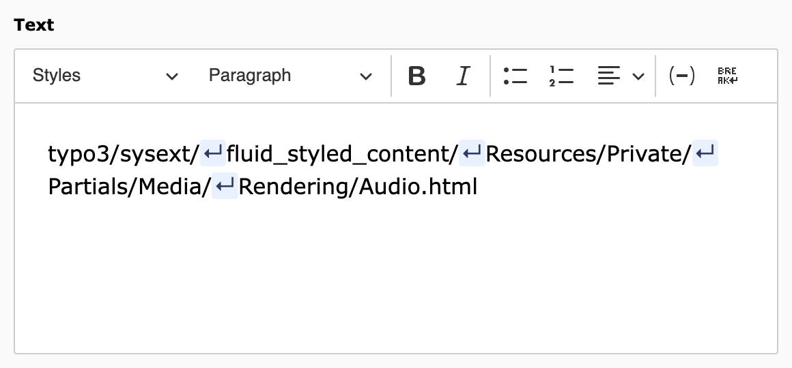
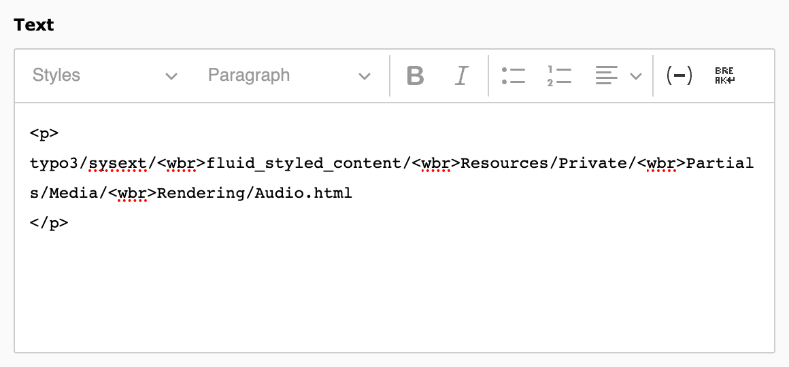
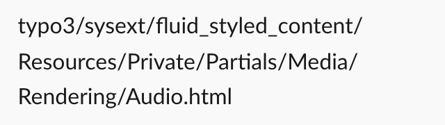

# CKEditor 5: wordbreak Plugin (TYPO3 Extension)

## Compatibility

TYPO3 12.4.0 - 14.3.99

## What does this extension do?

- This extension provides general support for the `<wbr>` HTML element in CKEditor 5 and TYPO3
- Editors can insert the element by pressing a button at the current cursor position
- All `<wbr>` elements are highlighted in the editor (similar to the softhyphen)

## `<wbr>`: The Line Break Opportunity element

* Allows a line break **without** adding a hyphen to the wrapped string
* Useful e.g. for long URLs or file paths, displayed on mobile websites or inside narrow parent elements

Line breaks are **only** applied by browsers if the word is too long for the surrounding element or viewport.

Further information: https://developer.mozilla.org/en-US/docs/Web/HTML/Element/wbr

## Screenshots

### CKEditor in TYPO3 backend: Highlighted line breaks in editor UI



The `<wbr>` elements are highlighted with an arrow on a colored background
(similar to the soft-hyphen in TYPO3's editor).

### CKEditor in TYPO3 backend: HTML source view



In the source editing mode, `<wbr>` elements are visible in the HTML.

### Frontend view (small viewport): Applied line breaks



In the frontend, the browser adds line breaks to the text where `<wbr>` elements are set
(but only where necessary).

## Installation

`composer req sebkln/ckeditor-wordbreak`

The extension needs to be installed as any other extension of TYPO3 CMS.

Perform the following steps:

1. Load and install the extension
2. **If necessary,** include the static template *"CKEditor plugin: wordbreak"* into your TypoScript template,
   or load the hidden Site Set `sebkln/ckeditor-wordbreak` as a dependency
   (see note below about `lib.parseFunc` in TYPO3 v13+)
3. Extend your CKEditor configuration (see below)

### CKEditor configuration

```
editor:
  config:
    # 1. Import the plugin:
    importModules:
      - { module: '@sebkln/ckeditor-wordbreak', exports: [ 'WordBreak' ] }

    toolbar:
      items:
        # 2. Add the button to your existing list of toolbar items:
        - WordBreak

# 3. Add <wbr> tag to list of tags that are allowed in the content:
processing:
  allowTags:
    - wbr
```

### Using `lib.parseFunc` in TYPO3 v13+

Beginning with TYPO3 v13, the properties `allowTags` and `denyTags` are now
[optional](https://docs.typo3.org/c/typo3/cms-core/main/en-us/Changelog/13.2/Feature-104220-MakeParseFuncAllowTagsAndDenyTagsOptional.html).

This means you **must only** add this extension's TypoScript if you use a custom version of `lib.parseFunc_RTE`
that already uses `allowTags` to restrict the HTML tags.
Otherwise, all tags except `<wbr>` would be encoded in the frontend.

Please note that this change only applies to TypoScript.
`allowTags` is still needed in the CKEditor's YAML configuration for processing.


### Using this plugin with EXT:visual_editor

If you use the short notation with `importModules` (`- '@sebkln/ckeditor-wordbreak'`),
the following error will occur when opening a page in the **Visual Editor backend module**: 

> **TypeError**
> 
> Cannot access offset of type string on string

Switch to the named import shown in the configuration above to fix this issue.

When using the Visual Editor backend module, the _WordBreak_ button will work as expected in richtext fields.

Please note that the Visual Editor only shows frontend styles.
Therefore, the styles to highlight the `<wbr>` tag will not be visible in this inline editing view.
